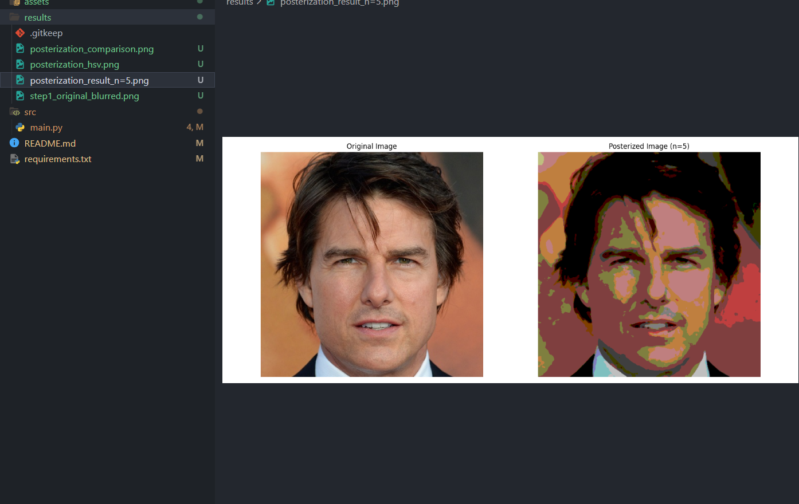

# BuildClub Technical Round – Posterization of Portraits

## 📝 Project Description

This project implements a **posterization  effect** on portrait images using OpenCV and Python. Posterization reduces the number of distinct colors in an image, creating an artistic, cartoon-like appearance by quantizing color values into discrete levels.

## 🎯 Approach

The implementation follows these key steps:

1. **Image Loading**: Load the input portrait image (`tom.jpg`) from the `assets/` folder using OpenCV.

2. **Color Space Conversion**: Convert the image from BGR to RGB format for proper color representation in matplotlib visualizations.

3. **Image Smoothing**: Apply median blur (kernel size 5) to reduce noise and create smoother color transitions in the final output.

4. **Look-Up Table (LUT) Creation**: Generate a custom LUT that maps the full 0-255 color range to `n` discrete levels (where `n` is the posterization level). This quantization is the core of the posterization effect.

5. **LUT Application**: Apply the LUT to all color channels of the blurred image using `cv2.LUT()`, which efficiently transforms pixel values according to the mapping.

6. **Multiple Level Comparison**: Generate posterized versions with different levels (n=2, 3, 4, 5, 6, 8) to demonstrate the effect of varying quantization.

7. **HSV Color Space Posterization**: As an alternative approach, convert the image to HSV color space and selectively posterize only the Saturation and Value channels while preserving the Hue, creating striking artistic effects.

8. **Visualization & Export**: Save all results as PNG files in the project directory for comparison and analysis.

## 🚀 How to Run

1. **Install dependencies**:
   ```bash
   pip install -r requirements.txt
   ```

2. **Place your portrait image** in the `assets/` folder (or use the provided `tom.jpg`).

3. **Run the main script**:
   ```bash
   python src/main.py
   ```

4. **View the output**: Check the generated PNG files in the project root:
   - `step1_original_blurred.png` - Original vs blurred comparison
   - `posterization_result_n=5.png` - Main posterization result
   - `posterization_comparison.png` - Multiple levels side-by-side
   - `posterization_hsv.png` - HSV color space posterization

## 🔧 Steps to Run Your Model

### Prerequisites
- Ensure Python 3.8 or higher is installed on your system
- Git installed for cloning the repository

### Step-by-Step Instructions

1. **Clone the Repository**
   ```bash
   git clone https://github.com/josephsaviokav/BuildClub_sub.git
   cd BuildClub_sub
   ```

2. **Set Up Virtual Environment** (Recommended)
   ```bash
   python -m venv venv
   # On Windows:
   venv\Scripts\activate
   # On macOS/Linux:
   source venv/bin/activate
   ```

3. **Install Required Dependencies**
   ```bash
   pip install -r requirements.txt
   ```
   This will install:
   - `opencv-python` - For image processing operations
   - `numpy` - For numerical operations and array handling
   - `matplotlib` - For visualization and saving output images

4. **Prepare Input Image**
   - The project comes with `tom.jpg` in the `assets/` folder
   - To use your own portrait image, place it in the `assets/` folder
   - Update the `image_path` variable in `src/main.py` if using a different filename:
     ```python
     image_path = "../assets/your_image.jpg"
     ```

5. **Run the Posterization Model**
   ```bash
   python src/main.py
   ```

6. **Check the Output**
   - The script will generate 4 PNG files in the project root directory:
     - `step1_original_blurred.png` - Shows original and blurred image comparison
     - `posterization_result_n=5.png` - Main posterization result with n=5 levels
     - `posterization_comparison.png` - Grid showing posterization at different levels (2, 3, 4, 5, 6, 8)
     - `posterization_hsv.png` - HSV color space posterization result
   - Console output will display the LUT values and confirmation messages

7. **Customize Posterization Levels** (Optional)
   - Open `src/main.py`
   - Modify the `n` variable (around line 39) to change the number of color levels:
     ```python
     n = 5  # Change this value (try 2-10 for different effects)
     ```
   - Re-run the script to see different posterization intensities

### Troubleshooting

- **ImportError**: Ensure all dependencies are installed with `pip install -r requirements.txt`
- **FileNotFoundError**: Verify that `tom.jpg` exists in the `assets/` folder and the path in `main.py` is correct
- **No output images**: Check write permissions in the project directory
- **Display issues**: The script uses matplotlib's `Agg` backend (non-interactive), so images are saved rather than displayed

## 📦 Dependencies

- Python 3.8+
- OpenCV (`opencv-python`)
- NumPy
- Matplotlib

## 🎨 Features

- Configurable posterization levels
- Multiple visualization outputs
- HSV color space transformation option
- Smooth color transitions with median blur
- Batch processing with different quantization levels

## 📁 Project Structure

```
BuildClub_sub/
├── src/
│   └── main.py          # Main posterization logic
├── assets/
│   └── tom.jpg          # Input portrait image
├── results/             # Output folder (optional)
├── requirements.txt     # Python dependencies
└── README.md           # This file
```

### Screenshots of the result


